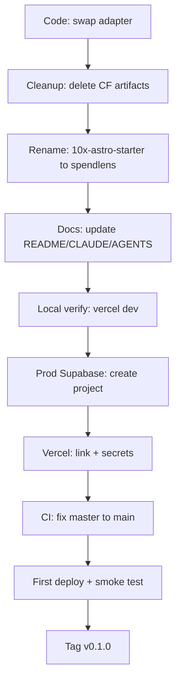

# First Release: Migrate to Vercel and Ship v0.1.0

## Scope (confirmed)

- **Infrastructure-only**. No new SpendLens product features; the released surface is what is already in `main`: email/password auth (`/auth/signin`, `/auth/signup`, `/auth/confirm-email`, `/api/auth/*`), middleware-based route protection, and a placeholder `/dashboard`.
- **Environment state**: Vercel CLI available locally, no Vercel project linked yet, no production Supabase project yet. The plan creates both.
- **Branch**: `main` (CI currently targets `master` — fix in step 7).
- **Tag**: cut `v0.1.0` after the first successful production deploy.

## High-level flow



---

## Step 1 — Code migration: adapter swap

Files touched: [astro.config.mjs](../../astro.config.mjs), [package.json](../../package.json).

In [astro.config.mjs](../../astro.config.mjs), replace the Cloudflare adapter wiring:

```ts
import cloudflare from "@astrojs/cloudflare";
// adapter: cloudflare(),
```

with:

```ts
import vercel from "@astrojs/vercel";
// adapter: vercel(),
```

Dependency changes in [package.json](../../package.json):

- Remove `@astrojs/cloudflare` and `wrangler` (devDeps).
- Add `@astrojs/vercel` (matching the pinned Astro 6 peer dep — confirmed by `npx astro add vercel`, which is the documented happy path in `infrastructure.md`).
- The `dev` script (`astro dev`) stays as-is for ordinary local dev; `vercel dev` is used only when we want runtime parity with the deployed function (env injection, `/api/*` shape). No script change required.

Env access: the codebase already uses `astro:env/server` (see [src/lib/supabase.ts](../../src/lib/supabase.ts) and [src/lib/config-status.ts](../../src/lib/config-status.ts)) and **never** touches `context.locals.runtime.env`. `astro:env/server` is adapter-agnostic and will resolve through Vercel's `process.env` injection automatically — no source changes needed here. We will validate this assumption with `vercel dev` in step 5 before deploying; if (and only if) it fails, fall back to reading `process.env.SUPABASE_URL` / `process.env.SUPABASE_KEY` in those two files.

## Step 2 — Cleanup of Cloudflare artifacts

- Delete [wrangler.jsonc](../../wrangler.jsonc).
- Edit [.gitignore](../../.gitignore): drop the `# cloudflare` block (`.dev.vars`, `.wrangler/`) and add a `# vercel` block (`.vercel/`, `.env*.local`).
- [.env.example](../../.env.example) stays identical (still `SUPABASE_URL` / `SUPABASE_KEY`).
- Local dev secrets convention changes from `.dev.vars` to `.env.local` (the file `vercel dev` reads). Will be reflected in the README.

## Step 3 — Rename project to `spendlens`

Replace every remaining `10x-astro-starter` / `10x Astro Starter` reference with the SpendLens identity. `package-lock.json` is regenerated by `npm install` in step 5, so no manual edit. `wrangler.jsonc` is already deleted in step 2.

Files touched:

- [package.json](../../package.json) — `"name": "10x-astro-starter"` → `"name": "spendlens"`. Bump `"version": "0.0.1"` → `"version": "0.1.0"` (aligned with the release tag in step 9).
- [supabase/config.toml](../../supabase/config.toml) — `project_id = "10x-astro-starter"` → `project_id = "spendlens"`. Affects `npx supabase start` local-stack identity only; production Supabase project (step 6) is separate.
- [src/layouts/Layout.astro](../../src/layouts/Layout.astro) — default `title` prop `"10x Astro Starter"` → `"SpendLens"`. All pages that omit the `title` prop ([index.astro](../../src/pages/index.astro), auth pages) inherit this.
- [src/components/Welcome.astro](../../src/components/Welcome.astro) — hero `<h1>` text `10x Astro Starter` → `SpendLens`. Marketing tagline below the heading is left alone for this release (it is generic, not misleading).
- [src/lib/config-status.ts](../../src/lib/config-status.ts) — `docsUrl` currently points at `https://github.com/przeprogramowani/10x-astro-starter#supabase-configuration`. Point it at the actual repo: `https://github.com/mmajewski-fp/spendlens#supabase-configuration`.
- [README.md](../../README.md) — title `# 10x Astro Starter` → `# SpendLens`, clone URL example `https://github.com/przeprogramowani/10x-astro-starter.git` → `https://github.com/mmajewski-fp/spendlens.git`, and `cd 10x-astro-starter` → `cd spendlens`.

Intentionally **not** renamed:

- Marketing/feature copy in [Welcome.astro](../../src/components/Welcome.astro) below the hero heading (generic "production-ready starter…" line). Rewriting it to SpendLens product copy is out of scope for an infra release.
- Repo directory name on your local filesystem (`kurs10x`) — not tracked in git.

## Step 4 — Documentation updates

Files touched: [README.md](../../README.md), [CLAUDE.md](../../CLAUDE.md), [AGENTS.md](../../AGENTS.md).

- [README.md](../../README.md): rewrite the Tech Stack bullet (Cloudflare → Vercel), the `.dev.vars` step (→ `.env.local`), the Deployment section (`npx wrangler deploy` → `vercel --prod` and the Vercel dashboard auto-deploy story), and the CI section (already mostly correct).
- [CLAUDE.md](../../CLAUDE.md): replace the three Cloudflare mentions — "Cloudflare workerd runtime", "Cloudflare local dev secrets in `.dev.vars`", and "Deploy: `npx wrangler deploy`" — with the Vercel equivalents. Update the env-vars line to "`.env` for Node, or `.env.local` for `vercel dev`".
- [AGENTS.md](../../AGENTS.md): update the same two mentions ("`.dev.vars` (gitignored) for local Cloudflare dev secrets" → "`.env.local` (gitignored) for local Vercel dev secrets"; "Production secrets: set via Cloudflare dashboard or `npx wrangler secret put`" → "Production secrets: set via Vercel dashboard or `vercel env add`").

## Step 5 — Local verification before deploy

1. `npm install` (refresh lockfile after dep swap).
2. `npx astro sync` and `npm run build` — must succeed against the new adapter with `SUPABASE_URL` / `SUPABASE_KEY` set in a temporary `.env`.
3. `npm run lint` — must pass.
4. `vercel dev` — boots the project under Vercel's runtime locally with `.env.local`. Walk through: load `/`, sign up a user, sign in, hit `/dashboard`. This is the gate that proves `astro:env/server` resolves under `@astrojs/vercel` before we touch production.

If any step fails, we stop and fix locally (e.g. fall back to `process.env` in `src/lib/supabase.ts`) — do not proceed to step 6.

## Step 6 — Production Supabase + Vercel project setup

This step needs **manual actions outside the repo**. The plan covers what I instruct you to do; I will not perform these myself.

Production Supabase project:

1. Create a new project at `https://supabase.com/dashboard` (region close to the Vercel deployment region; the default `iad1` ↔ `us-east` is fine).
2. From Settings → API, copy `URL` and `anon` key.
3. Auth → Email: keep "Confirm email" **on** for production (the [auth/confirm-email.astro](../../src/pages/auth/confirm-email.astro) flow expects this).
4. No migrations to run yet — the project only uses `auth.users`.

Vercel project link:

1. From the repo root: `vercel link` (creates `.vercel/` locally, gitignored after step 2).
2. `vercel env add SUPABASE_URL production` → paste the Supabase URL.
3. `vercel env add SUPABASE_KEY production` → paste the Supabase anon key.
4. Repeat for `preview` env so branch previews work against the same Supabase project (acceptable for MVP — preview-vs-prod data isolation is not required at this stage).

Once linked, Vercel auto-creates the GitHub integration, which gives us auto-deploy on push to `main` and preview URLs per branch (per `infrastructure.md` operational story).

## Step 7 — CI fix and final repo hygiene

[.github/workflows/ci.yml](../../.github/workflows/ci.yml) currently triggers on `master` but the default branch is `main`. Change both `push.branches` and `pull_request.branches` to `[main]`. Keep the workflow doing **lint + build only** — Vercel handles deployment via its GitHub integration, not a custom GH Action.

Add the same `SUPABASE_URL` / `SUPABASE_KEY` to GitHub repository secrets (Settings → Secrets and variables → Actions) so the build step has them. Use the production values; they are read-only `anon` keys and safe in CI build context.

## Step 8 — First production deploy + smoke test

1. Commit all changes from steps 1–4 + 7 in a single commit (`chore: migrate to vercel adapter, rename to spendlens, ship v0.1.0 release setup`).
2. Push to `main` → Vercel auto-deploys, GH Actions CI gates on lint+build in parallel.
3. Smoke test on the production URL:
   - Load `/` (Welcome screen renders, no missing-config banner).
   - Sign up with a real email → confirmation email arrives → click link → land on `/`.
   - Sign in with the same credentials → land on `/`.
   - Visit `/dashboard` → see the placeholder dashboard with the user email.
   - Sign out → redirected away from `/dashboard`.
4. Verify in Vercel dashboard: deployment status is `Ready`, function logs show no errors.

If any smoke test step fails, use `vercel logs <deployment-url> --follow` to diagnose, fix forward, and redeploy.

## Step 9 — Cut the release

1. `git tag v0.1.0` annotated with a short release note ("Infrastructure release: Vercel + Supabase Auth. Includes email/password sign-up/sign-in and protected `/dashboard`.").
2. `git push origin v0.1.0`.
3. Optionally, create a GitHub release pointing at this tag with the same note — useful as the manual rollback anchor noted in `infrastructure.md`'s risk register ("tag releases with `git tag` before each production deploy").

---

## Out of scope (explicit)

- SpendLens product features (FR-003 through FR-011 from [prd.md](../foundation/prd.md)).
- Rewriting the marketing/feature copy in [Welcome.astro](../../src/components/Welcome.astro) below the hero heading.
- Configuring the Vercel MCP server in Cursor (a separate developer-environment step; covered in `infrastructure.md` step 5 if you want it later).
- Preview URL protection (requires Vercel Pro per `infrastructure.md`).
- Database migrations or RLS — no application tables exist yet.

## Open items requiring human action

- Creating the Supabase production project and providing its URL + anon key.
- Running `vercel link` once (interactive auth) so the project is associated with your Vercel account.
- Adding `SUPABASE_URL` / `SUPABASE_KEY` to GitHub repository secrets.
- Confirming the GitHub release should be created in addition to the git tag.
